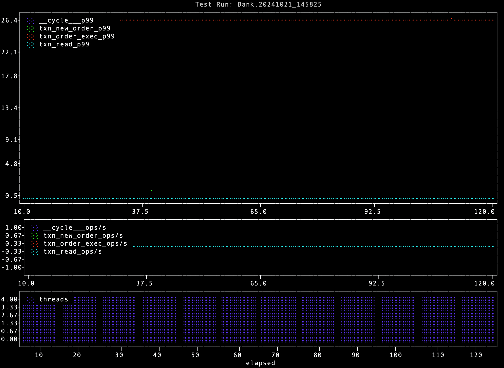

# Plot the metrics

We finished last section collectiong the metrics of a test run into a CSV file.

In this section, we explore 2 convenient built-in functions.

## Terminal Charts

A quick and easy way to chart the metrics in the CSV file is to do so on
the terminal client using the [plot](../util/plot.md) utility.

Generally, you run `dbworkload` on a VM server which doesn't have a GUI, unlike the personal computer or MacBook
you're reading this documentation from.

On your Terminal client, run this command to chart the metrics

```bash
dbworkload util plot -i Bank.20241021_145825.csv
```

A screenshot renders the output best



## Interactive HTML charts

Another charting option is using the more sophisticated util function [`html`](../util/html.md).

```bash
$ dbworkload util html -i Bank.20241021_145825.csv 
2024-10-21 11:26:30,304 [INFO] (MainProcess MainThread) util:423: Saved merged CSV file to '/path/to/workloads/Bank.20241021_145825.html'
```

Now open the `.html` file in your browser


You can scroll over the chart with your mouse to highlight datapoints.
You can also zoom in to reveal more details.

## Next

Congratulation, you reached the end of the tutorial! 🚀🚀🚀

Hopefully you grasped the basics of what `dbworkload` is and how to use it.

Make sure you continue reading the other sections of these docs for more details about
`dbworkload`'s inner workings.
